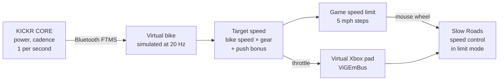

# slowroads-bridge

Ride [Slow Roads](https://store.steampowered.com/app/3431300/Slow_Roads/) with a Wahoo KICKR CORE smart
trainer. Your pedalling drives the car: push harder and it goes faster, stop and it coasts, and the game
steers itself.

It reads your power over Bluetooth, simulates a bike, and drives the game through a virtual Xbox
controller. It uses no game mods, no memory reading and no game telemetry.

> Windows only. Personal hobby project, not affiliated with Wahoo, Zwift or Slow Roads' developer.

## How it works



- **The game holds the speed.** Slow Roads' own speed limiter caps and actively slows the car, so hills,
  vehicles and gears are handled by the game. The bridge only sets the limit (mouse wheel over the game
  window, 5 mph a notch) and holds a throttle.
- **Smooth despite 1 Hz data.** The KICKR reports once a second on every Bluetooth channel (FTMS, Cycling
  Power and the Zwift protocol were all measured). Like Zwift, the bridge simulates a road bike between
  readings, so speed builds and fades with inertia.
- **Coasting.** Stop pedalling and the limit freezes one step up with a light throttle, so gravity decides:
  descents roll faster, climbs slow you down. After 12 s it eases to a stop. Pedal again and the limit
  holds for 8 s while your watts build.
- **Push bonus.** Above 150 W the gear ratio ramps up (+50% at 400 W), the limit steps up sooner and the
  throttle opens to 1.0, so hard efforts pay off.
- **Never reverses.** Braking at a stop in Slow Roads turns into reverse, so the bridge never holds a brake
  there.

### How the game limit steps


Six situations (starting, pushing hard, coasting, resuming, easing off, trainer dropout), simulated with
the bridge's real logic: **[docs/STEPPING.md](docs/STEPPING.md)**. There's also an
**[interactive version](https://jomarpueyo.github.io/slowroads-bridge/stepping.html)** you can step
through second by second.

## Requirements

- Windows 10/11 with Bluetooth LE
- A smart trainer with Bluetooth FTMS: tested on a Wahoo KICKR CORE; see [Trainer compatibility](#trainer-compatibility)
- Slow Roads (Steam) with a keyboard/mouse. No real controller plugged in while riding
- Installed by the setup script: Python 3.13, Git, [ViGEmBus](https://github.com/nefarius/ViGEmBus) 1.22.0
  (virtual controller driver, final release), and Python packages from the hash-locked `requirements*.txt`
  (edit the `.in` files and re-lock with `pip-compile --generate-hashes`)

## Trainer compatibility

The bridge reads only the standard Bluetooth fitness-machine data (FTMS Indoor Bike Data), and from that
only **power**. Nothing is Wahoo-specific: the parser handles any field layout the standard allows (fuzzed
with 300 000 packets) and the virtual bike works at any update rate. So any trainer that implements FTMS
correctly should work, but **only the Wahoo KICKR CORE has been tested**. Reports for other trainers are
welcome.

| Trainer | FTMS support (per sources below) | Expected to work |
| --- | --- | --- |
| Wahoo KICKR, KICKR CORE, CORE 2, SNAP, ROLLR | Yes (smart trainers from 2020 on) | **KICKR CORE tested**; others expected |
| Tacx Flux / Flux S / Flux 2, NEO 1 / 2 / 2T / 3M, Vortex | Yes; older units and firmware don't | Expected, with current firmware |
| Elite Suito, Direto, Justo, Drivo, Nero, Tuo, … | Yes; depends on manufacturing date | Expected on newer units |
| Saris H2 / H3 | Yes | Expected |
| Zwift Hub Classic / One | Yes | Expected |
| JetBlack (2020 on) | Yes | Expected |
| Van Rysel D100 / D500 / D900 (Decathlon) | Yes; cadence comes from a separate sensor | Expected: pedalling is detected from power alone |
| Smart bikes (KICKR Bike, NEO Bike, …) | Most support FTMS | Probably; untested |
| Older trainers without FTMS, ANT+-only units, a basic trainer with a separate power meter | No FTMS | **No.** Support for the Bluetooth Cycling Power service would cover these (not built yet) |

Notes for other trainers:

- **Pairing** looks for the FTMS service in the trainer's Bluetooth advertisement. If a trainer doesn't
  advertise it, pair by name once: `ride.bat --trainer pair --name Suito` (use part of its Bluetooth name).
- **Update rate:** most trainers send data once a second over Bluetooth. The virtual bike smooths this, so
  faster or slower trainers work the same way.
- **The game side** is independent of the trainer: Windows, Slow Roads, and mph by default
  (`--units km/h` otherwise).

Sources: [the5krunner: best smart trainer](https://the5krunner.com/best/best-cycling-products/best-smart-trainer/),
[icTrainer: compatibility](https://ictrainer.de/en/compatibility/),
[FulGaz: compatible trainers](https://support.fulgaz.com/hc/en-us/articles/14585827418637-Compatible-trainers-smart-trainers-and-smart-bikes-including-WAHOO-Tacx-and-Elite-trainers).

## Setup

```powershell
Get-ChildItem -Recurse | Unblock-File
powershell -ExecutionPolicy Bypass -File .\scripts\setup.ps1
```

It installs everything above with winget at pinned versions (the driver asks for admin; add
`-AllowLatest` if a pinned version is no longer offered), creates `.venv` with hash-checked packages,
checks the environment and runs the tests. It is safe to run again.

**Pairing:** the first ride connects to the first trainer advertising the fitness-machine service and saves
its Bluetooth address in `settings.json`; after that the bridge only connects to that trainer. Use
`ride.bat --trainer pair` to pair a different one.

## Ride

1. Close the Wahoo app and Zwift, and wake the trainer.
2. Double-click **`ride.bat`**.
3. In Slow Roads: assist **AUTOSTEER**, gearbox **Automatic**, **speed control on in limit mode** (the
   padlock by the speedometer), and keep the game window focused.
4. Pedal. Press Ctrl+C in the bridge window to stop.

The full checklist, every option (`--gear`, `--push-boost`, `--coast-hold`, …) and troubleshooting are in
**[QUICKSTART.md](QUICKSTART.md)**.

## Project layout

| Path | What |
| --- | --- |
| `bridge/` | The ride bridge: `ftms.py` (Bluetooth), `drive.py` (virtual bike, target speed), `limiter.py` (limit mode, coasting, push bonus), `pad.py` (virtual controller), `ridelog.py` (logs), `sim.py` (scripted test rides) |
| `tools/` | Checks and testing tools: ride summaries and replays, trainer probes, calibration, and **testing-only** screen-OCR experiments that drive the game (`experiments.py`, `speedo.py`, `debugpanel.py`, `ride_recorder.py`) |
| `tests/` | pytest suite (`.venv\Scripts\python -m pytest -q`) |
| `docs/RESEARCH.md` | Measurements, in-game test results and design decisions, section by section |
| `docs/SECURITY.md` | Security review: threat model, findings and what was tested |
| `docs/STEPPING.md`, `docs/stepping.html` | How the limit steps in six situations; regenerate with `tools/stepping_diagrams.py` |
| `ride.bat`, `calibrate.bat`, `scripts/setup.ps1` | Launchers and one-time setup |
| `settings.example.json` | Example calibration for the older `--mode speed`; the default limit mode needs none |

Each ride writes to `logs/` (git-ignored): trainer packets, 20 Hz controller decisions and, from the
recorder, the in-game speedometer, screenshots of the game window (never the desktop) and a copy of the
game's own saved settings. That's what the tuning in `docs/RESEARCH.md` is based
on.

## Testing without a bike

```powershell
.venv\Scripts\python -m bridge --sim "0:0:0,3:0:0,4:20:200,30:20,31:0:0,60:0"
```

This plays a scripted ride (`seconds:km/h:watts`) through the real bridge and the running game.

## License

[MIT](LICENSE)
