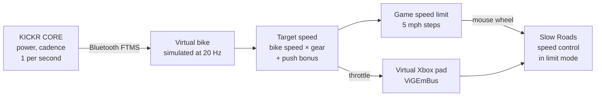

# slowroads-bridge

Ride [Slow Roads](https://store.steampowered.com/app/3431300/Slow_Roads/) with a Wahoo KICKR CORE smart
trainer. Your pedalling drives the car: push harder and it goes faster, stop and it coasts, and the game
steers itself.

It reads your power over Bluetooth, simulates a bike, and drives the game through a virtual Xbox
controller. It uses no game mods, no memory reading and no game telemetry.

> Windows only. Personal hobby project, not affiliated with Wahoo, Zwift or Slow Roads' developer.

## How it works



- **The game holds the speed.** Slow Roads' own speed limiter caps and actively slows the car, so hills,
  vehicles and gears are handled by the game. The bridge only sets the limit (mouse wheel over the game
  window, 5 mph a notch) and holds a throttle.
- **Smooth despite 1 Hz data.** The KICKR reports once a second on every Bluetooth channel (FTMS, Cycling
  Power and the Zwift protocol were all measured). Like Zwift, the bridge simulates a road bike between
  readings, so speed builds and fades with inertia.
- **Coasting.** Stop pedalling and the limit freezes one step up with a light throttle, so gravity decides:
  descents roll faster, climbs slow you down. After 12 s it eases to a stop. Pedal again and the limit
  holds for 8 s while your watts build.
- **Push bonus.** Above 150 W the gear ratio ramps up (+50% at 400 W), the limit steps up sooner and the
  throttle opens to 1.0, so hard efforts pay off.
- **Never reverses.** Braking at a stop in Slow Roads turns into reverse, so the bridge never holds a brake
  there.

### How the game limit steps


Six situations (starting, pushing hard, coasting, resuming, easing off, trainer dropout), simulated with
the bridge's real logic: **[docs/STEPPING.md](docs/STEPPING.md)**. There's also an
**[interactive version](https://jomarpueyo.github.io/slowroads-bridge/stepping.html)** you can step
through second by second.

## Requirements

- Windows 10/11 with Bluetooth LE
- A Wahoo KICKR CORE smart trainer (see [Supported trainer](#supported-trainer))
- Slow Roads (Steam) with a keyboard/mouse. No real controller plugged in while riding
- Installed by the setup script: Python 3.13, Git, [ViGEmBus](https://github.com/nefarius/ViGEmBus) 1.22.0
  (virtual controller driver, final release), and Python packages from the hash-locked `requirements*.txt`
  (edit the `.in` files and re-lock with `pip-compile --generate-hashes`)

## Supported trainer

This project is built and tested with a **Wahoo KICKR CORE** only, and that's the only trainer it
supports. It reads the standard Bluetooth fitness-machine (FTMS) power data, so another FTMS trainer
*might* work, but that's untested and there are no plans to test or add support for other trainers.

## Setup

```powershell
Get-ChildItem -Recurse | Unblock-File
powershell -ExecutionPolicy Bypass -File .\scripts\setup.ps1
```

It installs everything above with winget at pinned versions (the driver asks for admin; add
`-AllowLatest` if a pinned version is no longer offered), creates `.venv` with hash-checked packages,
checks the environment and runs the tests. It is safe to run again.

**Pairing:** the first ride connects to the first trainer advertising the fitness-machine service and saves
its Bluetooth address in `settings.json`; after that the bridge only connects to that trainer. Use
`ride.bat --trainer pair` to pair a different one.

## Ride

1. Close the Wahoo app and Zwift, and wake the trainer.
2. Double-click **`ride.bat`**.
3. In Slow Roads: assist **AUTOSTEER**, gearbox **Automatic**, **speed control on in limit mode** (the
   padlock by the speedometer), and keep the game window focused.
4. Pedal. Press Ctrl+C in the bridge window to stop, or just get off: the ride ends after 3 minutes
   without pedalling. The bridge starts the game through Steam once the trainer connects, beeps when
   something needs attention, and takes F6/F7 (gear), F8 (pause), F9 (re-sync) and F10 (overlay) while the game is in front. A subtle
   overlay at the top right shows ride time, virtual miles, watts, cadence, 1/5/10 min power and %FTP. You get a ride summary from the trainer's data
   (time, distance, average/normalized power, best efforts, kJ, cadence), saved in `logs/summary-*.txt`.

Something broke? Double-click **`report.bat`** and attach the zip to a
[new issue](https://github.com/jomarpueyo/slowroads-bridge/issues/new?template=bug_report.md). It holds
the crash report and recent logs with Bluetooth addresses, user/computer names and e-mail removed.

The full checklist, every option (`--gear`, `--push-boost`, `--coast-hold`, …) and troubleshooting are in
**[QUICKSTART.md](QUICKSTART.md)**.

## Project layout

| Path | What |
| --- | --- |
| `bridge/` | The ride bridge: `ftms.py` (Bluetooth), `drive.py` (virtual bike, target speed), `limiter.py` (limit mode, coasting, push bonus), `pad.py` (virtual controller), `ridelog.py` (logs), `summary.py` (ride summary and totals), `cues.py` / `hotkeys.py` (beeps, F6-F9), `cleanup.py` (old logs), `overlay.py` (trainer-data overlay), `crashreport.py` + `report.py` (crash reports, report.bat), `sim.py` (scripted test rides) |
| `tools/` | Checks and testing tools: ride summaries and replays, trainer probes, calibration, and **testing-only** screen-OCR experiments that drive the game (`experiments.py`, `speedo.py`, `debugpanel.py`, `ride_recorder.py`) |
| `tests/` | pytest suite (`.venv\Scripts\python -m pytest -q`) |
| `docs/SECURITY.md` | Security review: threat model, findings and what was tested |
| `docs/STEPPING.md`, `docs/stepping.html` | How the limit steps in six situations; regenerate with `tools/stepping_diagrams.py` |
| `ride.bat`, `report.bat`, `calibrate.bat`, `scripts/setup.ps1` | Launchers and one-time setup |
| `settings.example.json` | Example calibration for the older `--mode speed`; the default limit mode needs none |

Each ride writes to `logs/` (git-ignored): trainer packets, 20 Hz controller decisions and, from the
recorder, the in-game speedometer, screenshots of the game window (never the desktop) and a copy of the
game's own saved settings. That's what the tuning is based on.

## Testing without a bike

```powershell
.venv\Scripts\python -m bridge --sim "0:0:0,3:0:0,4:20:200,30:20,31:0:0,60:0"
```

This plays a scripted ride (`seconds:km/h:watts`) through the real bridge and the running game.

`tests/test_fuzz_bridge.py` (part of the suite) and `tools/fuzz_bridge.py --minutes 10` feed corrupt,
extreme, flooding, silent and dropping-out trainer data through the real bridge loop in dry-run mode and
check that it never crashes, the controls stay in range, and the logs and summary are written.

## License

[MIT](LICENSE)
