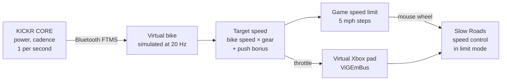

# slowroads-bridge

Ride [Slow Roads](https://store.steampowered.com/app/3431300/Slow_Roads/) with a Wahoo KICKR CORE smart
trainer. Your pedalling drives the car: push harder and it goes faster, stop and it coasts, and the game
steers itself.

It reads your power over Bluetooth, simulates a bike, and drives the game through a virtual Xbox
controller. It uses no game mods, no memory reading and no game telemetry.

> Windows only. Personal hobby project, not affiliated with Wahoo, Zwift or Slow Roads' developer.

## How it works



- **The game holds the speed.** Slow Roads' own speed limiter caps and actively slows the car, so hills,
  vehicles and gears are handled by the game. The bridge only sets the limit (mouse wheel over the game
  window, 5 mph a notch) and holds a throttle.
- **Smooth despite 1 Hz data.** The KICKR reports once a second on every Bluetooth channel (FTMS, Cycling
  Power and the Zwift protocol were all measured). Like Zwift, the bridge simulates a road bike between
  readings, so speed builds and fades with inertia.
- **Coasting.** Stop pedalling and the limit freezes one step up with a light throttle, so gravity decides:
  descents roll faster, climbs slow you down. After 12 s it eases to a stop. Pedal again and the limit
  holds for 8 s while your watts build.
- **Push bonus.** Above 150 W the gear ratio ramps up (+50% at 400 W), the limit steps up sooner and the
  throttle opens to 1.0, so hard efforts pay off.
- **Never reverses.** Braking at a stop in Slow Roads turns into reverse, so the bridge never holds a brake
  there.

## Requirements

- Windows 10/11 with Bluetooth LE
- Wahoo KICKR CORE (other FTMS trainers will probably work but are untested)
- Slow Roads (Steam) with a keyboard/mouse. No real controller plugged in while riding
- Installed by the setup script: Python 3.13, Git, [ViGEmBus](https://github.com/nefarius/ViGEmBus) 1.22.0
  (virtual controller driver, final release), and Python packages from `requirements*.txt`

## Setup

```powershell
Get-ChildItem -Recurse | Unblock-File
powershell -ExecutionPolicy Bypass -File .\scripts\setup.ps1
```

It installs everything above with winget (the driver asks for admin), creates `.venv`, checks the
environment and runs the tests. It is safe to run again.

## Ride

1. Close the Wahoo app and Zwift, and wake the trainer.
2. Double-click **`ride.bat`**.
3. In Slow Roads: assist **AUTOSTEER**, gearbox **Automatic**, **speed control on in limit mode** (the
   padlock by the speedometer), and keep the game window focused.
4. Pedal. Press Ctrl+C in the bridge window to stop.

The full checklist, every option (`--gear`, `--push-boost`, `--coast-hold`, …) and troubleshooting are in
**[QUICKSTART.md](QUICKSTART.md)**.

## Project layout

| Path | What |
| --- | --- |
| `bridge/` | The ride bridge: `ftms.py` (Bluetooth), `drive.py` (virtual bike, target speed), `limiter.py` (limit mode, coasting, push bonus), `pad.py` (virtual controller), `ridelog.py` (logs), `sim.py` (scripted test rides) |
| `tools/` | Checks and testing tools: ride summaries and replays, trainer probes, calibration, and **testing-only** screen-OCR experiments that drive the game (`experiments.py`, `speedo.py`, `debugpanel.py`, `ride_recorder.py`) |
| `tests/` | pytest suite (`.venv\Scripts\python -m pytest -q`) |
| `docs/RESEARCH.md` | Measurements, in-game test results and design decisions, section by section |
| `ride.bat`, `calibrate.bat`, `scripts/setup.ps1` | Launchers and one-time setup |
| `settings.example.json` | Example calibration for the older `--mode speed`; the default limit mode needs none |

Each ride writes to `logs/` (git-ignored): trainer packets, 20 Hz controller decisions and, from the
recorder, the in-game speedometer and screenshots. That's what the tuning in `docs/RESEARCH.md` is based
on.

## Testing without a bike

```powershell
.venv\Scripts\python -m bridge --sim "0:0:0,3:0:0,4:20:200,30:20,31:0:0,60:0"
```

This plays a scripted ride (`seconds:km/h:watts`) through the real bridge and the running game.

## License

[MIT](LICENSE)
