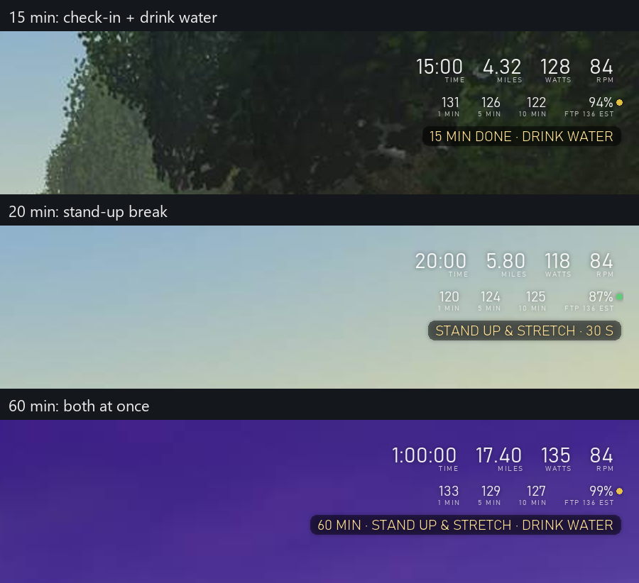
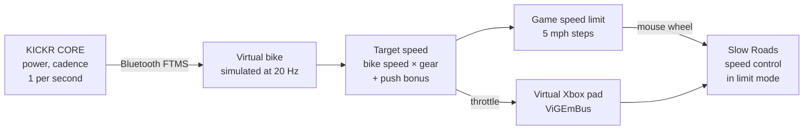
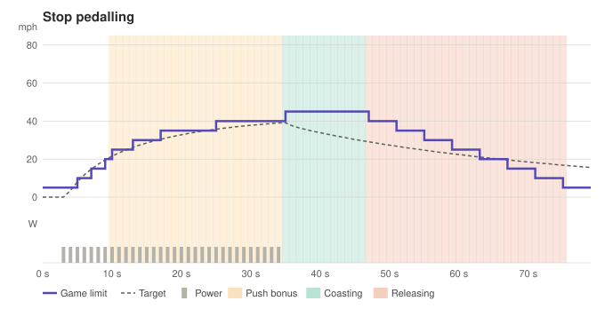
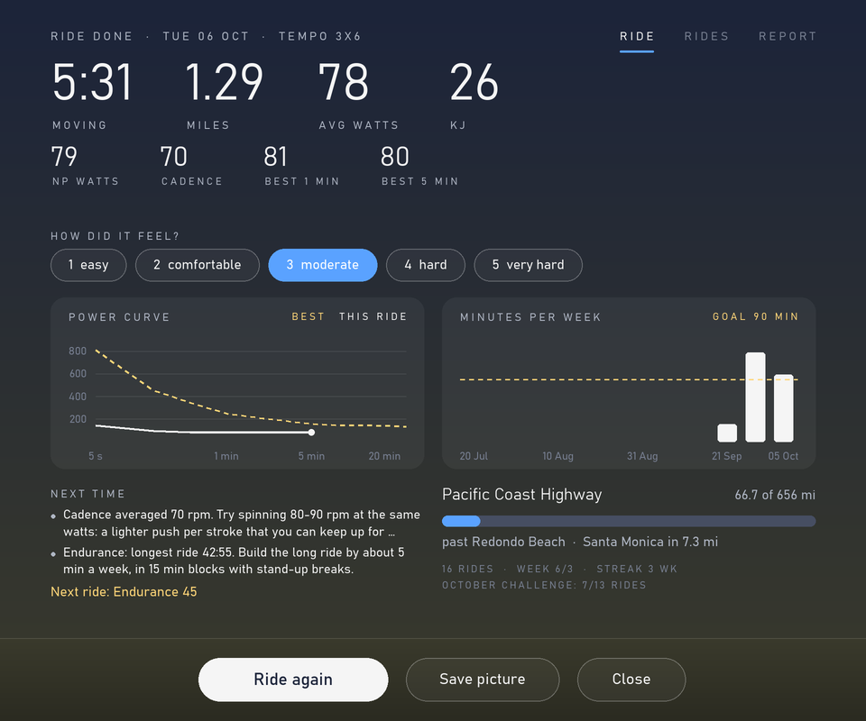

# slowroads-bridge

Ride [Slow Roads](https://store.steampowered.com/app/3431300/Slow_Roads/) with a Wahoo KICKR CORE smart
trainer. Your pedalling drives the car: push harder and it goes faster, stop and it coasts, and the game
steers itself.

It reads your power over Bluetooth, simulates a bike, and drives the game through a virtual Xbox
controller. It also sets the trainer's resistance: ERG for workout targets, otherwise a road feel that is
draggier on gravel. It uses no game mods and no memory reading; the only thing it reads from the game is
which road you picked, from the game's own saved settings file.

> Windows only. Personal hobby project, not affiliated with Wahoo, Zwift or Slow Roads' developer.

A small overlay sits at the top right of the game: ride time, virtual miles, watts and cadence, your 1, 5
and 10 minute average power, and your share of FTP with its zone colour. Short coach messages pop up
underneath with a beep, so long rides are easier and you remember the basics:



After 20 s the numbers fade to about a third so they don't pull your eyes, and only the one that matters
lights up for a moment (each minute, each mile, a power surge, 100+ rpm). Everything on it comes from the
trainer, never from the game. F10 hides it.

## How it works



- **The game holds the speed.** Slow Roads' own speed limiter caps and actively slows the car, so hills,
  vehicles and gears are handled by the game. The bridge only sets the limit (mouse wheel over the game
  window, 5 mph a notch) and holds a throttle.
- **Smooth despite 1 Hz data.** The KICKR reports once a second on every Bluetooth channel (FTMS, Cycling
  Power and the Zwift protocol were all measured). Like Zwift, the bridge simulates a road bike between
  readings, so speed builds and fades with inertia.
- **Coasting.** Stop pedalling and the limit freezes one step up with a light throttle, so gravity decides:
  descents roll faster, climbs slow you down. After 12 s it eases to a stop. Pedal again and the limit
  holds for 8 s while your watts build.
- **Push bonus.** Above 150 W the gear ratio ramps up (+50% at 400 W), the limit steps up sooner and the
  throttle opens to 1.0, so hard efforts pay off.
- **Resistance.** In workout blocks with a power target the trainer runs in ERG and holds the watts
  whatever your gear. Otherwise it simulates a flat road whose drag grows with your speed, with higher
  rolling resistance on the game's dirt roads. ERG lets go when you stop pedalling or in rest blocks, and
  the trainer is reset at the end of every ride (`--no-resistance` turns it all off).
- **Never reverses.** Braking at a stop in Slow Roads turns into reverse, so the bridge never holds a brake
  there.

### How the game limit steps



Six situations (starting, pushing hard, coasting, resuming, easing off, trainer dropout), simulated with
the bridge's real logic: **[docs/STEPPING.md](docs/STEPPING.md)**. There's also an
**[interactive version](https://jomarpueyo.github.io/slowroads-bridge/stepping.html)** you can step
through second by second.

## Requirements

- Windows 10/11 with Bluetooth LE
- A Wahoo KICKR CORE smart trainer (see [Supported trainer](#supported-trainer))
- Slow Roads (Steam) with a keyboard/mouse. No real controller plugged in while riding
- Installed by the setup script: Python 3.13, Git, [ViGEmBus](https://github.com/nefarius/ViGEmBus) 1.22.0
  (virtual controller driver, final release), and Python packages from the hash-locked `requirements*.txt`
  (edit the `.in` files and re-lock with `pip-compile --generate-hashes`)

## Supported trainer

This project is built and tested with a **Wahoo KICKR CORE** only, and that's the only trainer it
supports. It reads the standard Bluetooth fitness-machine (FTMS) power data, so another FTMS trainer
*might* work, but that's untested and there are no plans to test or add support for other trainers.

## Setup

```powershell
Get-ChildItem -Recurse | Unblock-File
powershell -ExecutionPolicy Bypass -File .\scripts\setup.ps1
```

It installs everything above with winget at pinned versions (the driver asks for admin; add
`-AllowLatest` if a pinned version is no longer offered), creates `.venv` with hash-checked packages,
checks the environment and runs the tests. It is safe to run again.

**Pairing:** the first ride connects to the first trainer advertising the fitness-machine service and saves
its Bluetooth address in `settings.json`; after that the bridge only connects to that trainer. Use
`ride.bat --trainer pair` to pair a different one.

## Ride

1. Close the Wahoo app and Zwift, and wake the trainer.
2. Double-click **Slow Roads Ride** on your desktop (or `ride.bat`). One window does everything, with
   three tabs: **Ride** (your week, today's suggestion, a free ride or a workout, the road feel, then
   **Begin** or Enter), **Rides** (your latest ride, records and charts) and **Report** (a zip of your
   logs for a bug report). It fits on one screen with nothing to scroll and scales to any window size and
   Windows display scaling. The window, the share card and the charts page share one look: a dusk
   gradient, light Bahnschrift numbers and small spaced labels, gold for anything new and blue for
   progress.
3. In Slow Roads: assist **AUTOSTEER**, gearbox **Automatic**, **speed control on in limit mode** (the
   padlock by the speedometer), and keep the game window focused.
4. Pedal. The bridge starts the game through Steam once the trainer connects, and the window gets out of
   the way once the game is in front. The trainer holds workout targets (ERG) and otherwise gives a road
   feel that follows your speed, draggier on gravel roads (read from the road you chose in the game). It
   beeps when something needs attention and takes F6/F7 (gear), F8 (pause), F9 (re-sync) and F10
   (overlay) while the game is in front.
5. Get off the bike: the ride ends after 3 minutes without pedalling (or press **end ride** in the
   window). The window comes back with your ride: time, miles, power, records, a 1-5 "how did it feel",
   your power curve against your best, minutes per week against your goal, the journey and what to do
   next ride. The text summary is also saved in `logs/summary-*.txt`. The **Rides** tab shows the same
   view for your latest ride any time.



Quiet extras keep it going: a welcome back after a break, a ride plan (`python -m bridge.plan`), a nudge to
finish easy, your lifetime miles as a trip along the Pacific Coast Highway, your last similar ride as a
ghost, a monthly challenge, and a share-card picture of a ride (**save picture** in the window).

The console version (status line and keyboard menu) is still there: `ride-console.bat`.

Something broke? Open the **Report** tab, press **Make report** and attach the zip to a
[new issue](https://github.com/jomarpueyo/slowroads-bridge/issues/new?template=bug_report.md) (or
double-click `report.bat` if the window itself won't open). It holds the crash report and recent logs with
Bluetooth addresses, user/computer names and e-mail removed.

The full checklist, every option (`--gear`, `--push-boost`, `--coast-hold`, …) and troubleshooting are in
**[QUICKSTART.md](QUICKSTART.md)**.

## Project layout

| Path | What |
| --- | --- |
| `bridge/` | The ride bridge: `ftms.py` (Bluetooth), `trainer.py` (resistance: ERG and road feel), `gamestate.py` (road type from the game's saved settings), `drive.py` (virtual bike, target speed), `limiter.py` (limit mode, coasting, push bonus), `mapper.py` (throttle mapping), `pad.py` (virtual controller), `gamewin.py` (finds the game window, safe scroll points), `ridelog.py` (logs), `summary.py` (ride summary and totals), `cues.py` / `hotkeys.py` (beeps, F6-F10), `cleanup.py` (old logs), `overlay.py` (trainer-data overlay), `ridebook.py` / `coach.py` / `workouts.py` / `companion.py` / `dashboard.py` (ride book, scoreboard, workouts, in-ride coach, charts), `app.py` (the ride window: ride, ride book and reports), `theme.py` (the shared look: colours, fonts, charts, scaling), `units.py` (miles/km, time format), `motivation.py` / `plan.py` / `sharecard.py` (welcome back, ride plan, journey, ghost, monthly challenge, share card), `crashreport.py` + `report.py` (crash reports, report.bat), `sim.py` (scripted test rides) |
| `tools/` | Checks and testing tools: ride summaries and replays, trainer probes, calibration, and **testing-only** screen-OCR experiments that drive the game (`experiments.py`, `speedo.py`, `debugpanel.py`, `ride_recorder.py`) |
| `tests/` | pytest suite (`.venv\Scripts\python -m pytest -q`) |
| `docs/SECURITY.md` | Security review: threat model, findings and what was tested |
| `docs/STEPPING.md`, `docs/stepping.html` | How the limit steps in six situations; regenerate with `tools/stepping_diagrams.py` |
| `ride.bat`, `rides.bat`, `ride-console.bat`, `report.bat`, `calibrate.bat`, `scripts/setup.ps1`, `scripts/shortcuts.ps1`, `assets/ride.ico` | Launchers (`ride.bat` / `rides.bat` open the window; `ride-console.bat` is the console version; `report.bat` works even if the window can't start), one-time setup, the desktop shortcut and its icon |
| `settings.example.json` | Example calibration for the older `--mode speed`; the default limit mode needs none |

Each ride writes to `logs/` (git-ignored): trainer packets, 20 Hz controller decisions and, from the
recorder, the in-game speedometer, screenshots of the game window (never the desktop) and a copy of the
game's own saved settings. That's what the tuning is based on.

## Testing without a bike

```powershell
.venv\Scripts\python -m bridge --sim "0:0:0,3:0:0,4:20:200,30:20,31:0:0,60:0"
```

This plays a scripted ride (`seconds:km/h:watts`) through the real bridge and the running game.

`tests/test_fuzz_bridge.py` (part of the suite) and `tools/fuzz_bridge.py --minutes 10` feed corrupt,
extreme, flooding, silent and dropping-out trainer data through the real bridge loop in dry-run mode and
check that it never crashes, the controls stay in range, and the logs and summary are written.

## License

[MIT](LICENSE)
