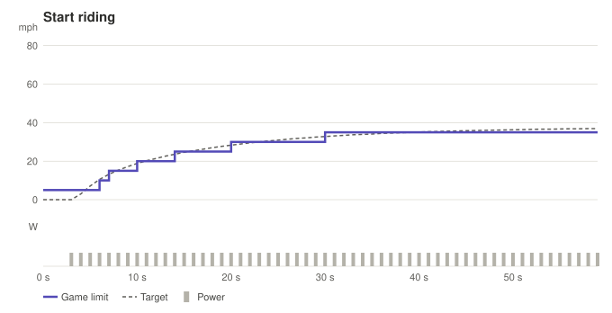
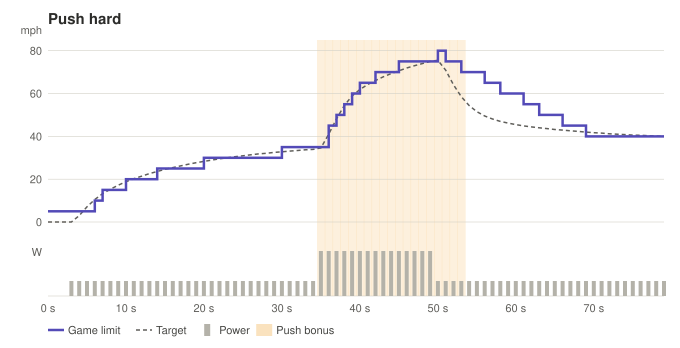
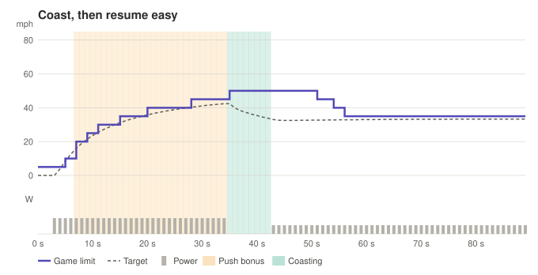
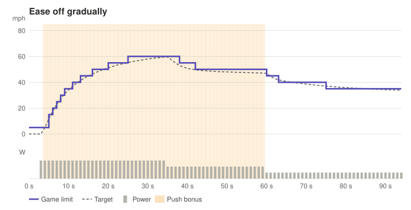
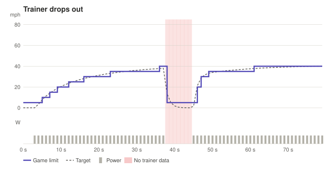

# How the game limit steps

Each chart runs one riding situation through the bridge's real logic: 1 trainer packet per second, 20 Hz control loop, virtual bike at gear 2.0, default push bonus and coasting. The **purple steps** are the speed limit the bridge sets in Slow Roads (the game holds the car there), the **dashed line** is your target speed, grey bars are power, and shaded bands mark push bonus, coasting, releasing and trainer dropouts.

**Interactive version** (step through second by second, or play): <https://jomarpueyo.github.io/slowroads-bridge/stepping.html> (GitHub Pages), or download [`stepping.html`](stepping.html) and open it in a browser.

Regenerate after changing the control logic: `.venv\Scripts\python tools\stepping_diagrams.py`.

## Start riding

Steady 150 W from a standstill. The virtual bike builds speed with inertia, so the limit climbs a step at a time and settles.

## Push hard

150 W, then a 450 W effort for 15 s, then back to 150 W. The push bonus raises the gear, steps the limit up early and opens the throttle.

## Stop pedalling

Ride at 180 W, then stop. The limit freezes one step up with a light throttle (the game's gravity decides), then after 12 s eases down to a stop.

## Coast, then resume easy

Coast for 8 s, then pedal again at only 110 W. The limit holds for 8 s while watts build, then steps down one notch at a time.

## Ease off gradually

300 W, then 200 W, then 100 W. Downward steps are rate-limited, so the car never snaps to a lower speed.

## Trainer drops out

Bluetooth goes quiet for 10 s mid-ride. After 3 s without data the throttle is cut and the limit goes to the floor; riding resumes when data returns.

## What each state means

| State | What the bridge does |
| --- | --- |
| stopped | throttle 0 and the limit at the 5 mph floor. Pedal to start. |
| riding | the limit follows your target in 5 mph steps and the game holds the car at it. Throttle stays at 0.6; the game caps the speed. |
| push | above 150 W the gear rises (up to x1.5 at 400 W), the limit steps up as soon as the target passes it, and the throttle opens toward 1.0. |
| coasting | you stopped pedalling. The limit freezes one step above your last speed with a light 0.05 throttle, so the game's gravity decides: descents roll faster, climbs slow the car. |
| releasing | 12 s without pedalling, so the limit eases down 5 mph every 4 s to a stop. Throttle goes to 0 for the last 10 mph. Pedal to resume. |
| stale | after 3 s without a packet the throttle is cut and the limit goes to the floor. Riding resumes as soon as data returns. |
